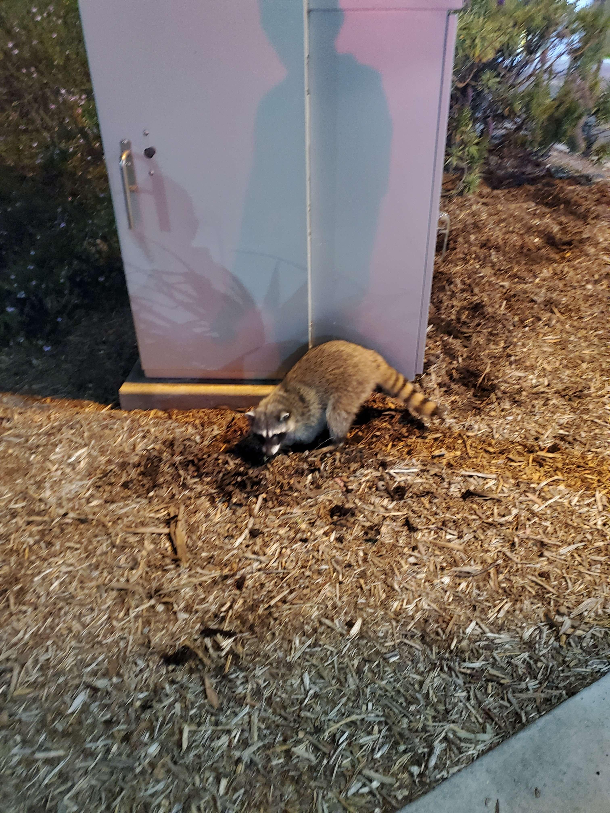
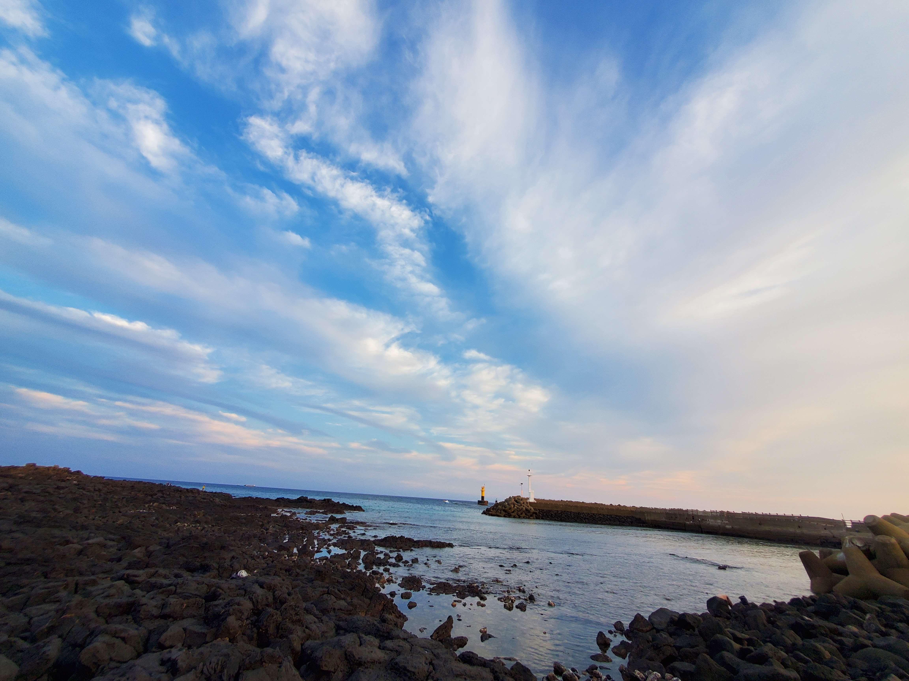
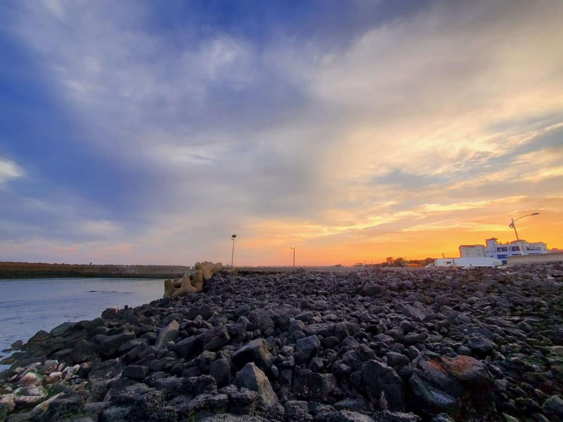

# Daniel Lee's User Page

## About me

My name is Daniel Lee, and I am a *CS Major* at **UCSD**.

~~I like to learn from mistakes~~

***I like to play video games***

<sub>I haven't played World of Warcraft</sub>

<sup>I play League of Legends</sup>

Click [here](#lists) to see a list of my favorite games

Here is a picture of a racoon I found on campus



I like going to the beach. Here are some pictures:






## Some Quotes

As Abraham Lincoln said:

>A house divided against itself cannot stand

I keep that in mind when writing code.
```
std::cout << "Hello World!" << std::endl;
```

### Links

I like using [Wikipedia](https://wikipedia.org/) to learn about topics.

## Relevant files

Here are some [algorithms](algorithms.md) I learned in cse 101.

## Lists

A list of my favorite games, in no particular order:

* Team Fortress 2
* Dark Souls 3
* Bloodborne
* Sekiro: Shadows Die Twice
* Elden Ring
* The Witcher 3

A list of my favorite presidents, in order

1. Abraham Lincoln
    - Very cool president
      - Led the US during the Civil War
2. George Washington
3. William Howard Taft
4. Franklin D. Roosevelt

## CSE Classes

These are some CSE classes I have taken, and some I have not taken yet

- [x] CSE 11
- [x] CSE 12
- [x] CSE 30
- [x] CSE 100
- [x] CSE 101
- [x] CSE 105
- [ ] CSE 110 (in progress)
- [ ] CSE 120
- [ ] CSE 130 (in progress)
- [ ] CSE 140/140L
- [x] CSE 151A
- [ ] CSE 151B (in progress)